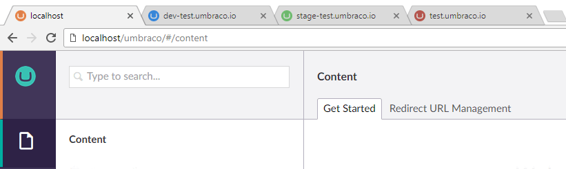

# Umbraco CMS Environment Indicator

When developing websites using Umbraco in multi-environment solution, you can often get confused which environment you are currently looking at.

As a visual aid, this package will add a colour-coded indicator in the CMS back-office - this is applied to both the favicon (in the browser tab/title-bar) and adds a stripe to your avatar (in the top-left navigation).



## Contribution and development

For the majority of users this will be a "install and forget" package, but if you want to go further, here's the low down.

### Install Dependencies

If you want to automate the building or deployment of this package, you can use Grunt:

```bash
npm install -g grunt-cli
npm install
```

### Build

```bash
grunt
```

#### Build Umbraco package

```bash
grunt package
```

#### Build NuGet package

```bash
grunt nuget
```

### Watch

```bash
grunt watch
```
